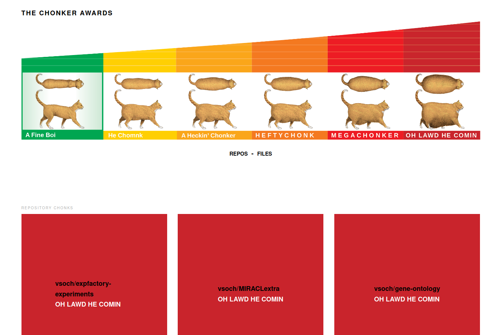

# The Chonker Awards

I had a terrible idea that I wanted to make a "chonker awards" site, where I could
quickly see the top, chonkiest files and repositories from my GitHub. 



> This workflow has been disabled in 2023 because GitHub search doesn't seem to any longer allow finding large files.

## Usage

You can run the [find-chonkers.py](find-chonkers.py) manually to generate the
data in the [_data](_data) folder. This renders to the site. A [GitHub Workflow](.github/workflows)
is also provided to run the script on a nightly (or other frequency) basis.
You can choose to be conservative and open a pull request to check first,
or just push directly to your main branch. Keep in mind if you run the script
locally, you should export a `GITHUB_TOKEN` to increase your rate limit.

```bash
$ python find-chonkers.py vsoch
```

Since the file search API doesn't return sizes, we do a head of each to determine
the size (this is why the script takes longer than you might expect). 

### Finding Large Files

Since we can't return a list of all files and sort them, the strategy I use is to
start at a high number that will return very few results, and then decrease the size
in increments until we reach a desired number (approximately 60, but in practice increases to more). 
If you customize this for your own purposes, you might also want to change the function defaults
to minimum sizes, and the increment that you decrease each time to find new files.

## License

Open sourced under the [MIT license](LICENSE).
